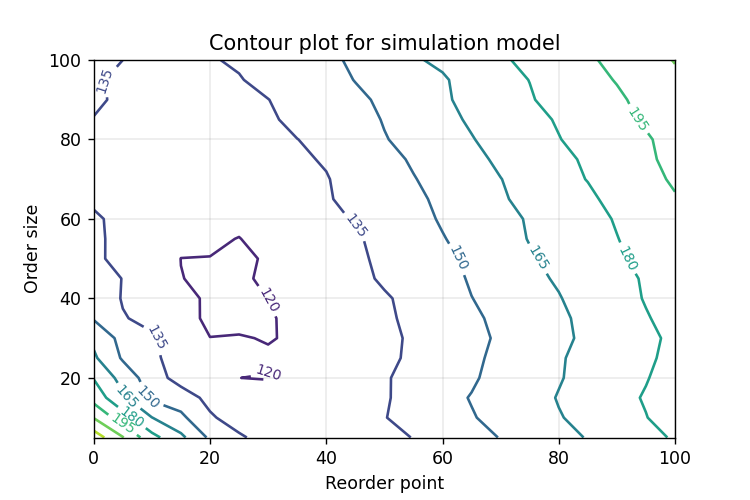

# Inventory simulation tutorial

This repository contains a discrete-event simulation (DES) model of a single product inventory system. It is built on the inventory system described in Law and Kelton's *Simulation Modeling and Analysis (3rd Edition, 2000)* and is aimed to be used as a tutorial on creating DES models in Python and peforming and statistical analysis of a terminating simulation output.

**Table of Contents**
1. [Tutorial objectives](#objectives) 
2. [Simulation conceptual model](#conceptual-model)
3. [Results overview](#results)
4. [Future improvements](#to-do)

## 1. Tutorial objectives
The model simulates various inventory policy systems and allows users to determine the reorder point and order size parameters minimizing total inventory costs.

It is aimed to be used as an introduction to building and analyzing simulation models in Python. Several concepts are described in this tutorial, including:
* Confidence intervals
* Comparisons of alternative systems
* Response surface and contour plots

**Using the simulation model**
* model.py contains the simulation model
* output_analysis.ipynb contains the step by step tutorial to analyze output data

## 2. Simulation conceptual model
A company wants to determine which policy will minimize monthly costs for a single product inventory. The company needs to decide on a reorder point (number of units under which an order will be placed) and an order size. Inventory levels are reviewed once a month. The performance of the policy is evaluated over a 120 months period.

**Customer demands**

The time between demands is exponentially distributed with a mean of 0.1 month.

The size of demands varies from 1 to 4 items with the following probability:
- size = 1 with p = 1/6
- size = 2 with p = 1/3
- size = 3 with p = 1/3
- size = 4 with p = 1/6

Customer demands are met immediately if there are enough items in stock. If not, the excess of demand is backlogged and will be met as soon as there are enough units in inventory.

**Inventory replenishment**

At the beginning of each month, the company decides what quantity of items to order from the supplier. There is a fixed cost associated with placing an order of $32. Each individual items costs the company $3 to order.

The flow time of the order is uniformly distributed between 0.5 and 1 month. Upon receipt of an order, items are immediately used to fulfill any existing backlog demand. Otherwise, they are placed in inventory.

The company uses a stationary (s,S) policy to decide how much to order. If the current inventory level is above s, no order will be placed. If it's below s, the company will place an order to replenish inventory up to S units (i.e. place an order of size S - current inventory level).

**Inventory costs**

The company incurs a holding cost of $1 per month for every item in inventory and a shortage cost of $3 per month for every item backlogged.

## 3. Results overview

Simulating many combinations of different order sizes and reorder points allows to produce a contour plot the expected monthly total costs of the system. 

A reorder point of 30 with an order size of 25 result in the lowest possible monthly costs of below $120 monthly.

Total costs increase drastically when reorder point and order size decrease below 20 units. This is due to the prevalence of shortages that are heavily penalized with a monthly cost of $3 for every item backlogged.

Similarly, significantly increasing reorder point and order size also drive costs up since it requires higher inventory levels, therefore resulting in higher holding costs.

## 4. Future improvements
 - Add additional decision variables to the model (such as frequency of inventory review)
 - Add brief introduction to design of experiments (DOE) like 2k factorial design to illustrate computation and interpretation of main effects and interactions
